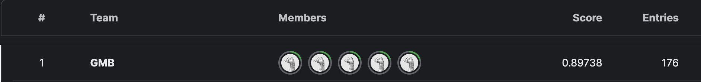
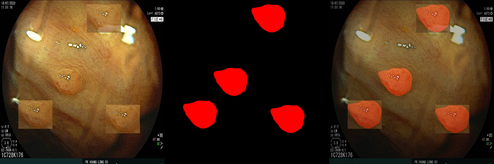
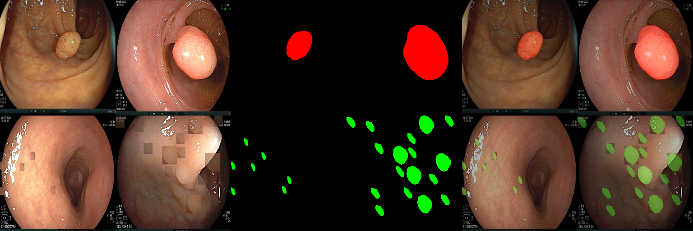

# Semantic Segmentation



이 저장소는 2023년, Google Machine Learning Boot Camp에 참가했을 때 만들어진 것입니다.

Kaggle에서 BKAI-IGH NeoPolyp 대회에서 사용되었으며, 2024년에 추가적으로 정리했습니다.

## 1.SetUp

필요에 따라 가상환경, 아나콘다를 활용할 수 있으며 필요한 라이브러리들을 설치합니다.

    conda install pytorch==2.0.1 torchvision==0.15.2 torchaudio==2.0.2 -c pytorch
    pip install -r requirements.txt


## 2.Core Tech

### 2-1.SegFormer
 - [https://arxiv.org/abs/2105.15203](https://arxiv.org/abs/2105.15203)
 - [hugging face - Segformer](https://huggingface.co/docs/transformers/model_doc/segformer#segformer)


### 2-2.Spatially Exclusive Paste

[https://arxiv.org/pdf/2211.08284v3.pdf](https://arxiv.org/pdf/2211.08284v3.pdf)






## 3.Usage

1. 기본적으로 ```config.yaml```에서 데이터 경로, 저장 경로를 비롯해 학습에 적용될 하이퍼파라미터 값을 설정합니다.
2. 설정이 완료되었다면, ```train.py```를 통해 학습을 시작합니다.
3. 학습이 시작되면 ```SemanticSegmentation/runs``` 디렉터리가 생성될 것이며, train.py를 실행한 날짜에 해당하는 폴더가 만들어집니다.
4. 학습이 끝나면 ```test.py```에서 127번째 라인 ```saved_dir = "./runs/2024_04_02_14_23_22"``` 을 수정하고 실행시킵니다.