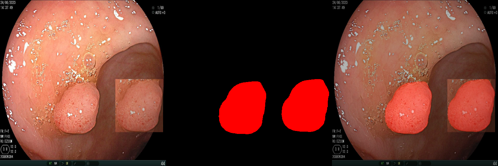

# BKAI-IGH NeoPolyp

이 저장소는 2023-Google ML BootCamp에 참가해 Kaggle의 BKAI-IGH NeoPolyp 대회를 진행하면서 기록한 내용입니다.

## 1.SetUp & Usage

필요에 따라 가상환경, 아나콘다를 활용할 수 있으며 필요한 라이브러리들을 설치합니다.

    conda install pytorch==2.0.1 torchvision==0.15.2 torchaudio==2.0.2 -c pytorch
    pip install -r requirements.txt

1. 기본적으로 `config.yaml`에서 데이터 경로, 저장 경로를 비롯해 학습에 적용될 하이퍼파라미터 값을 설정합니다.
2. 설정이 완료되었다면, `train.py` 또는 `cv_train.py`를 통해 학습을 시작합니다.
3. 학습이 시작되면 `SemanticSegmentation/runs` 디렉터리가 생성될 것이며, train.py를 실행한 날짜에 해당하는 폴더가 만들어집니다.
4. 학습이 끝나면 `test.py`에서 127번째 라인 `saved_dir = "./runs/2024_04_02_14_23_22"` 을 수정하고 실행시킵니다.

## 2.문제 분석

이 대회는 입력된 이미지에서 폴립(Polyp) 영역에 존재하는 픽셀들을 분류하는 Semantic Segmentation Task입니다.  
모든 폴립은 빨간색과 녹색으로 표시되는 마스크 데이터가 존재하며 빨간색은 신생물 폴립(NeoPolyp), 초록색은 비신생물 폴립(Non NeoPolyp) 클래스로 분류됩니다.

test 데이터셋을 학습된 모델에 입력시켰을 때 발생하는 추론 마스크 $X$를 저장한 다음, 정답 마스크 $Y$와 mean Dice Coefficient을 평가하게 됩니다.

- 분모는 두 마스크의 픽셀들을 모두 더한 값인데, 마스크의 height, width는 같으니까 결국 픽셀 수 \* 2인 셈.
- 분자는 두 마스크에서 일치하는 픽셀의 수에 2를 곱한 값이므로 예측의 정확도가 높을 수록 분모와 분자가 같아져 1에 가까워집니다.
- 결과적으로 정확한 픽셀단위 분류 모델을 만들수록 높은 평가 점수를 받을 수 있습니다.

## 2.Data Analysis

### 2-1.Basic Dataset

주어진 데이터셋은 1000장의 학습 이미지와 200장의 테스트 이미지로 구성되어 있습니다.  
  

Label인 mask는 .png 형식의 파일이며 background(black), neoplastic polyp(red), non-neoplastic polyp(green)으로 구성되어 있습니다.  
특이사항은 마스크를 구성하는 각 클래스 픽셀은 [0, 0, 0], [255, 0, 0], [0, 255, 0]으로 구성되지 않고 RGB 채널값이 다양합니다. 따라서 적절한 임계값을 기준으로 픽셀들을 전처리 해주는 과정이 필요합니다.

### 2-2.Mask Encodig & Decoding

- 원본 마스크를 픽셀 단위로 검사하면서 0(background), 1(non-neoplastic polyp), 2(neoplastic poyp)로 구성되는 이진 마스크로 encoding합니다.
- 인코딩을 적용함으로써 마스크의 픽셀값이 명확하게 구분되고, 각 클래스들의 분포를 확인할 수 있습니다.
- 인코딩이 적절하게 되었는지 검증하기 위해 decoding하면 원본 마스크와 유사한 결과를 얻을 수 있습니다. 0 -> [0, 0, 0], 1 -> [0, 255, 0], 2 -> [255, 0, 0]

### 2-3.Data Distribution

각각의 마스크마다 빨간색, 초록색 또는 빨간색과 초록색이 함께 있는 이미지의 분포를 확인해보면 693, 257, 50개로 불균형적임을 확인할 수 있으며 전체 데이터셋이 1000개로 규모가 매우 작기 때문에 Cross Validation을 적용해 학습하는 전략을 취하는 것이 좋아 보입니다.

### 2-4.Spatially Exclusive Paste

[https://arxiv.org/pdf/2211.08284v3.pdf](https://arxiv.org/pdf/2211.08284v3.pdf)

class imbalance를 해결하기 위한 방법 중 하나로, 기존의 copy-paste augmentation에서 원본 이미지가 가진 foreground object를 복사하여 중첩되지 않는 위치에 붙여넣는 augmentation입니다.  
이 방법을 적용하여 리더보드 스코어가 2% 향상되었습니다.

## 3.Train

### 3-1.Focal Loss

$$ FL(p_t)= -\alpha_t(1-p_t)^\gamma log(p_t) $$

- $p_t$ 는 모델이 정답 클래스에 대해 예측한 확률로, 정답 클래스에 대해서는 $p_t$를 그대로 사용하고, 잘못된 클래스에 대해서는 $1-p_t$를 사용합니다.
- $\alpha_t$는 클래스별 가중치로 클래스마다 서로 다른 가중치를 적용할수 있도록 합니다.
- $\gamma$는 쉽게 분류되는 데이터 샘플들의 손실을 줄이는 역할로, $\gamma$가 클수록 어려운 데이터 샘플에 더 집중하게 만듭니다.
- 만약 모델이 예측한 확률 $p_t$가 클 때, $(1-p_t)^\gamma$ 항에 의해 손실의 값을 감소시킵니다.
- $\alpha_t$항은 데이터 수가 더 작은 클래스에 큰 가중치를 부여해 손실의 영향력을 증폭시킵니다.

앞서 클래스별 분포를 측정했기 때문에, 이들을 이용해 각 클래스의 가중치를 계산하고 $\alpha$로 설정합니다.

### 3-2.SegFormer
